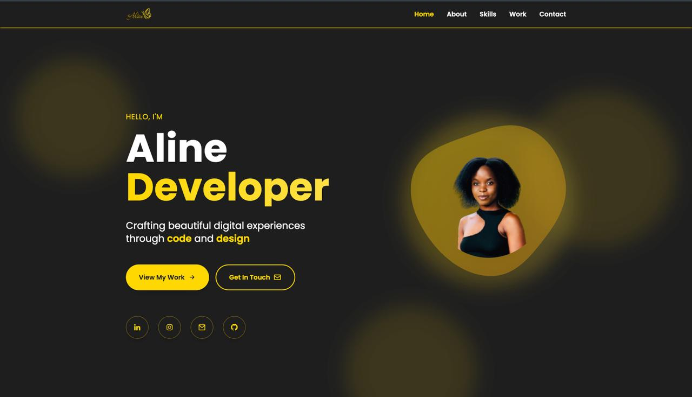
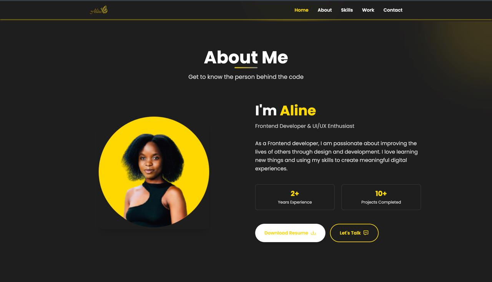
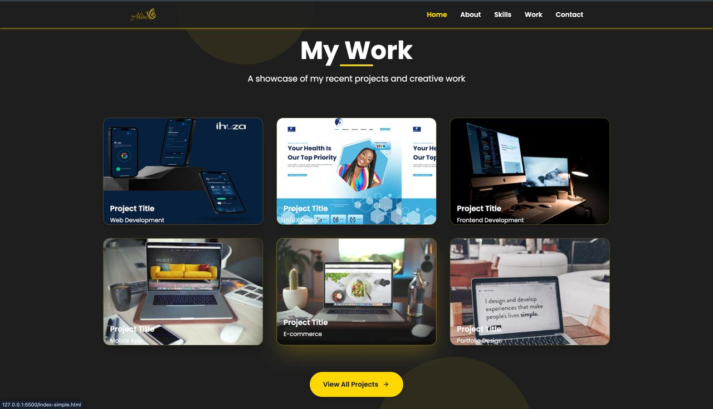
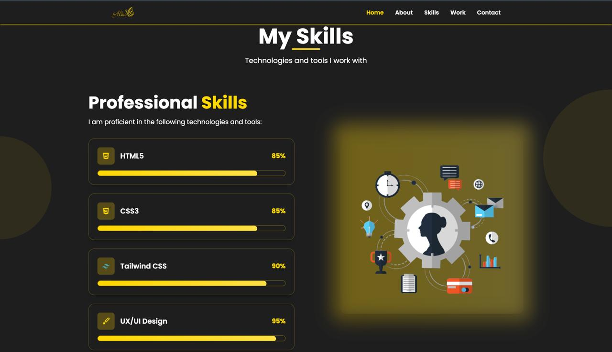
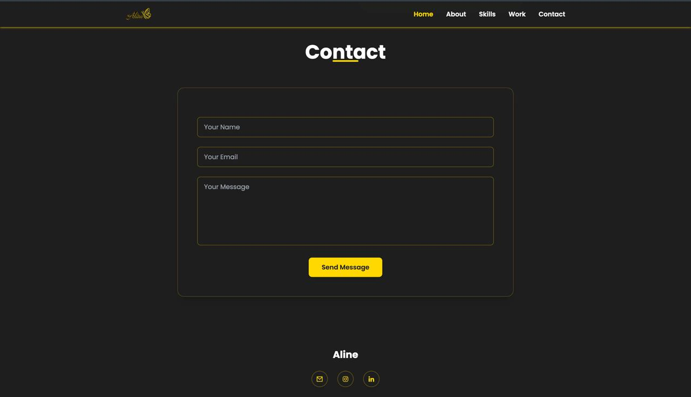

# 🌐 My Portfolio Website

## I am a Frontend Developer passionate about Tech Industry. My goal as a tech woman is to leverage my skills and passion for innovation to contribute meaningfully to the field, advocate for diversity and inclusion, and inspire the next generation of women to pursue and thrive in technology.

## 📸 Screenshots

### 🏠 Home Page


### About Me


### work


### skills


### contact



---
## 🚀 Live site
[a-line-s-portofolio-l65z.vercel.app](https://a-line-s-portofolio.vercel.app/)

## ✨ Features
- Animated hero with a typing effect and floating profile picture
- About, Skills, Experience & Education sections
- Projects page with technology filters, live demo and source code links
- Working contact form (Web3Forms) with sending, success and error states
- Downloadable resume
- Link previews for LinkedIn, WhatsApp and X, plus a custom browser icon
- Custom 404 page and a back-to-top button
- Fully responsive, from phones to large screens

## Tech stack
- [Next.js](https://nextjs.org) (App Router) + React
- TypeScript
- Tailwind CSS
- Framer Motion

## How to run locally
```bash
git clone https://github.com/Ualine055/ALine-s-portofolio.git
cd ALine-s-portofolio
npm install
npm run dev
```
Then open http://localhost:3000.

Other scripts:
- `npm run build` – production build
- `npm run lint` – lint the code

## Project structure
```
src/
  app/          pages (home and /projects)
  components/   page sections (Navbar, Hero, About, Skills, Work, Contact, Footer)
  data/         content: projects.ts (projects) and experience.ts (experience & education)
public/assets/  images and resume
```
